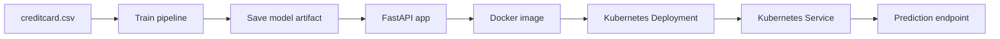

# Fraud Detection ML on Kubernetes

An end-to-end fraud detection project that trains a machine learning model on the credit card fraud dataset, serves predictions through a FastAPI application, packages the service in Docker, and deploys it on Kubernetes.

## What This Project Does

- Trains a fraud detection model from `data/creditcard.csv`
- Builds a preprocessing + classification pipeline with scikit-learn
- Saves the trained pipeline to `artifacts/fraud_pipeline.pkl`
- Serves predictions through a FastAPI API in `app.py`
- Runs the API in Docker
- Deploys the container to Kubernetes using `deployment.yaml` and `service.yaml`

## Project Flow



## Repository Structure

```text
ML-k8s-deployment/
├── app.py
├── deployment.yaml
├── Dockerfile
├── requirements.txt
├── service.yaml
├── artifacts/
├── data/
│   └── creditcard.csv
└── src/
    ├── pipeline.py
    └── train.py
```

## Model Architecture

The training code in `src/train.py`:

- Loads the dataset from `data/creditcard.csv`
- Splits the data into train and test sets
- Builds a preprocessing pipeline from `src/pipeline.py`
- Uses:
	- `SimpleImputer(strategy="median")` for numeric features
	- `StandardScaler()` for numeric scaling
	- `SimpleImputer(strategy="most_frequent")` for categorical features
	- `OneHotEncoder(handle_unknown="ignore")` for categorical encoding
	- `RandomForestClassifier(class_weight="balanced")` as the final model
- Evaluates the model with confusion matrix, classification report, and AUPRC
- Saves the trained pipeline to `artifacts/fraud_pipeline.pkl`

## API Behavior

The FastAPI app in `app.py`:

- Loads the saved model artifact at startup
- Exposes `GET /` for a simple health message
- Exposes `POST /predict` for fraud predictions
- Accepts a JSON object, converts it to a pandas DataFrame, and returns:
	- `fraud_prediction`
	- `fraud_probability`

## Local Setup

### 1. Create and activate a virtual environment

```bash
python -m venv .venv
.venv\Scripts\activate
```

### 2. Install dependencies

```bash
pip install -r requirements.txt
```

## Train the Model

Run the training script from the project root:

```bash
python src/train.py
```

This creates `artifacts/fraud_pipeline.pkl`, which is the model file used by the API.

## Run the API Locally

Start the FastAPI app with Uvicorn:

```bash
uvicorn app:app --reload
```

Open:

- `http://127.0.0.1:8000/`
- `http://127.0.0.1:8000/docs`

### Example Prediction Request

```bash
curl -X POST "http://127.0.0.1:8000/predict" ^
	-H "Content-Type: application/json" ^
	-d "{\"feature_1\": 0, \"feature_2\": 1}"
```

Replace the payload with the feature names and values expected by the trained model.

## Docker

Build the image:

```bash
docker build -t fraud-api .
```

Run the container:

```bash
docker run -p 8000:8000 fraud-api
```

The container starts the API with:

```bash
uvicorn app:app --host 0.0.0.0 --port 8000
```

## Kubernetes Deployment

This project uses Minikube for local Kubernetes testing.

### 1. Start Minikube

```bash
minikube start
```

### 2. Load the Docker image into Minikube

```bash
minikube image load fraud-api
```

### 3. Apply the manifests

```bash
kubectl apply -f deployment.yaml
kubectl apply -f service.yaml
```

### 4. Check resources

```bash
kubectl get pods
kubectl get deployments
kubectl get services
```

### 5. Open the service

```bash
minikube service fraud-api-service
```

## Kubernetes Concepts Used

- **Deployment** keeps the desired number of pods running and supports rolling updates
- **Service** provides a stable endpoint for the pods
- **Replica count** gives basic horizontal scaling
- **imagePullPolicy: Never** is used for local Minikube testing with a locally loaded image

## Useful Commands

Scale the deployment:

```bash
kubectl scale deployment fraud-api-deployment --replicas=5
```

View logs:

```bash
kubectl logs <pod-name>
```

Inspect a pod:

```bash
kubectl describe pod <pod-name>
```

Delete a pod to test self-healing:

```bash
kubectl delete pod <pod-name>
```

Update the image for a rolling deployment:

```bash
kubectl set image deployment/fraud-api-deployment fraud-api-container=fraud-api:v2
```

## Why This Project Matters

This is more than a basic ML demo. It shows how to:

- Separate training from inference
- Package a model as a deployable service
- Run a stateless API in a container
- Deploy and scale that container on Kubernetes
- Use Kubernetes for availability, updates, and self-healing

## Notes

- The API expects the same feature schema used during training.
- If you change the model or input columns, retrain the pipeline and rebuild the Docker image.
