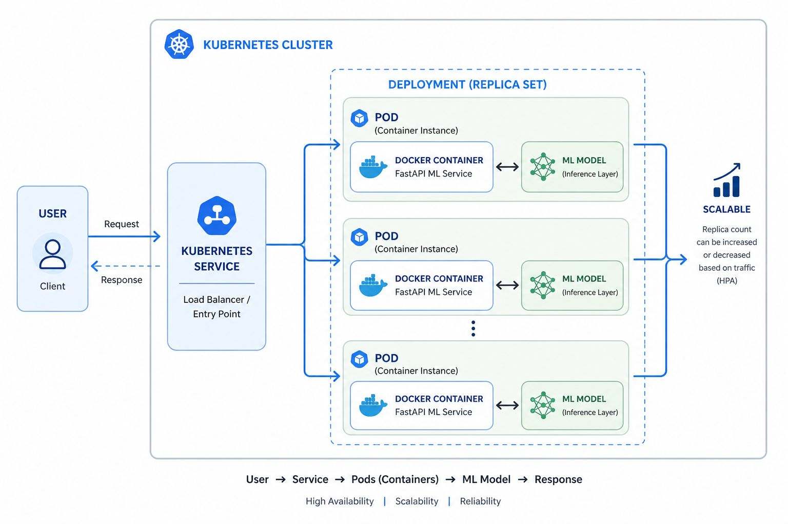
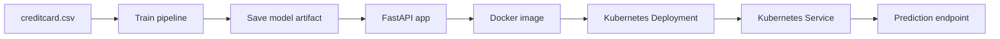

# Fraud Detection ML on Kubernetes

<p align="center">
  <br/>
</p>

An end-to-end fraud detection project that trains a machine learning model on the credit card fraud dataset, stores the trained pipeline in AWS S3, serves predictions through a FastAPI application, packages the service in Docker, and deploys it on Kubernetes.

## What This Project Does

- Trains a fraud detection model from `data/creditcard.csv`
- Builds a preprocessing + classification pipeline with scikit-learn
- Saves the trained pipeline to `artifacts/fraud_pipeline.pkl`
- Serves predictions through a FastAPI API in `app.py`
- Uses AWS S3 and `boto3` to download the saved model at startup
- Downloads the model from S3 at API startup and loads it into memory
- Runs the API in Docker
- Deploys the container to Kubernetes using `deployment.yaml` and `service.yaml`

## Project Flow



## Repository Structure

```text
ML-k8s-deployment/
├── app.py
├── deployment.yaml
├── Dockerfile
├── requirements.txt
├── service.yaml
├── artifacts/
├── data/
│   └── creditcard.csv
└── src/
    ├── pipeline.py
    └── train.py
```

## Model Architecture

The training code in `src/train.py`:

- Loads the dataset from `data/creditcard.csv`
- Splits the data into train and test sets
- Builds a preprocessing pipeline from `src/pipeline.py`
- Uses:
	- `SimpleImputer(strategy="median")` for numeric features
	- `StandardScaler()` for numeric scaling
	- `SimpleImputer(strategy="most_frequent")` for categorical features
	- `OneHotEncoder(handle_unknown="ignore")` for categorical encoding
	- `RandomForestClassifier(class_weight="balanced")` as the final model
- Evaluates the model with confusion matrix, classification report, and AUPRC
- Saves the trained pipeline to `artifacts/fraud_pipeline.pkl`

## API Behavior

The FastAPI app in `app.py`:

- Downloads the saved model artifact from S3 at startup
- Exposes `GET /` for a simple health message
- Exposes `POST /predict` for fraud predictions
- Accepts a JSON object, converts it to a pandas DataFrame, and returns:
	- `fraud_prediction`
	- `fraud_probability`

### Runtime Requirements

The API expects AWS credentials and access to the configured S3 bucket so it can download `artifacts/fraud_pipeline.pkl` when the app starts.

## AWS Setup

This project uses AWS S3 through `boto3` to load the saved model at startup.

- The bucket name is `fraud-ml-model-storage-amie-2026`
- The model key is `artifacts/fraud_pipeline.pkl`
- You must provide valid AWS credentials before starting the API locally or in Docker

One common local setup is to configure credentials with the AWS CLI:

```bash
aws configure
```

If you deploy to Kubernetes or Docker on a server, make sure that environment also has permission to read from the S3 bucket.

## Local Setup

### 1. Create and activate a virtual environment

```bash
python -m venv .venv
.venv\Scripts\activate
```

### 2. Install dependencies

```bash
pip install -r requirements.txt
```

### 3. Run the API locally

Start the FastAPI app with Uvicorn through the current Python environment:

```bash
python -m uvicorn app:app --reload
```

Open:

- `http://127.0.0.1:8000/`
- `http://127.0.0.1:8000/docs`

## Train the Model

Run the training script from the project root:

```bash
python src/train.py
```

This creates `artifacts/fraud_pipeline.pkl`, which is the model file used by the API.

### Example Prediction Request

```bash
curl -X POST "http://127.0.0.1:8000/predict" ^
	-H "Content-Type: application/json" ^
	-d "{\"Time\": 0, \"V1\": 0, \"V2\": 0, \"V3\": 0, \"V4\": 0, \"V5\": 0, \"V6\": 0, \"V7\": 0, \"V8\": 0, \"V9\": 0, \"V10\": 0, \"V11\": 0, \"V12\": 0, \"V13\": 0, \"V14\": 0, \"V15\": 0, \"V16\": 0, \"V17\": 0, \"V18\": 0, \"V19\": 0, \"V20\": 0, \"V21\": 0, \"V22\": 0, \"V23\": 0, \"V24\": 0, \"V25\": 0, \"V26\": 0, \"V27\": 0, \"V28\": 0, \"Amount\": 0}"
```

Replace the payload with the feature names and values expected by the trained model.

## Docker

Build the image:

```bash
docker build -t amiezz/fraud-api:v1 .
```

If you built the image with a local name like `fraud-api`, tag it for Docker Hub first:

```bash
docker tag fraud-api amiezz/fraud-api:v1
```

Log in to Docker Hub before pushing:

```bash
docker login
```

Run the container:

```bash
docker run -p 8000:8000 amiezz/fraud-api:v1
```

The container starts the API with:

```bash
uvicorn app:app --host 0.0.0.0 --port 8000
```

Push the image to Docker Hub:

```bash
docker push amiezz/fraud-api:v1
```

After pushing, update your Kubernetes deployment to use the Docker Hub image reference `amiezz/fraud-api:v1`.

## Kubernetes Deployment

This project uses Minikube for local Kubernetes testing.

### 1. Start Minikube

```bash
minikube start
```

### 2. Load the Docker image into Minikube

```bash
minikube image load amiezz/fraud-api:v1
```

This step is only needed if you are testing a locally built image in Minikube. The current deployment manifest is configured to pull `amiezz/fraud-api:v1` from the registry.

### 3. Apply the manifests

```bash
kubectl apply -f deployment.yaml
kubectl apply -f service.yaml
```

The deployment currently uses the image `amiezz/fraud-api:v1` and `imagePullPolicy: Always`.

### 4. Check resources

```bash
kubectl get pods
kubectl get deployments
kubectl get services
```

### 5. Open the service

```bash
minikube service fraud-api-service
```

If you are not using Minikube, use the external IP or load balancer address assigned to the service instead of `0.0.0.0`.

## Kubernetes Concepts Used

- **Deployment** keeps the desired number of pods running and supports rolling updates
- **Service** provides a stable endpoint for the pods
- **Replica count** gives basic horizontal scaling
- **imagePullPolicy: Always** ensures Kubernetes pulls the latest `amiezz/fraud-api:v1` image from the registry

## Useful Commands

Scale the deployment:

```bash
kubectl scale deployment fraud-api-deployment --replicas=5
```

View logs:

```bash
kubectl logs <pod-name>
```

Inspect a pod:

```bash
kubectl describe pod <pod-name>
```

Delete a pod to test self-healing:

```bash
kubectl delete pod <pod-name>
```

Update the image for a rolling deployment:

```bash
kubectl set image deployment/fraud-api-deployment fraud-api-container=amiezz/fraud-api:v2
```

## Why This Project Matters

This is more than a basic ML demo. It shows how to:

- Separate training from inference
- Package a model as a deployable service
- Run a stateless API in a container
- Deploy and scale that container on Kubernetes
- Use Kubernetes for availability, updates, and self-healing

## Notes

- The API expects the same feature schema used during training.
- If you change the model or input columns, retrain the pipeline and rebuild the Docker image.
- The app currently downloads the model from S3 during startup, so local runs require network access and valid AWS credentials.
